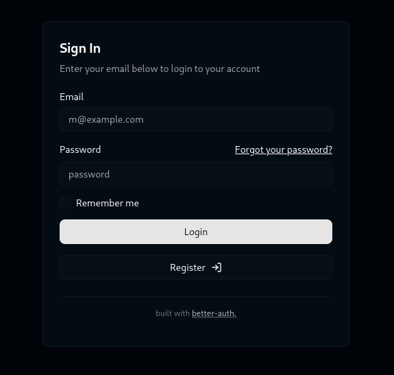
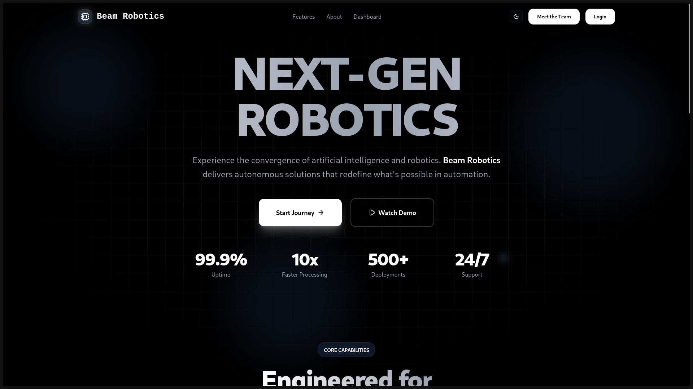
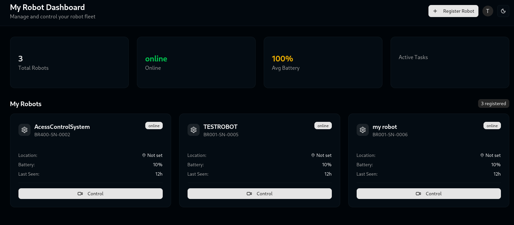
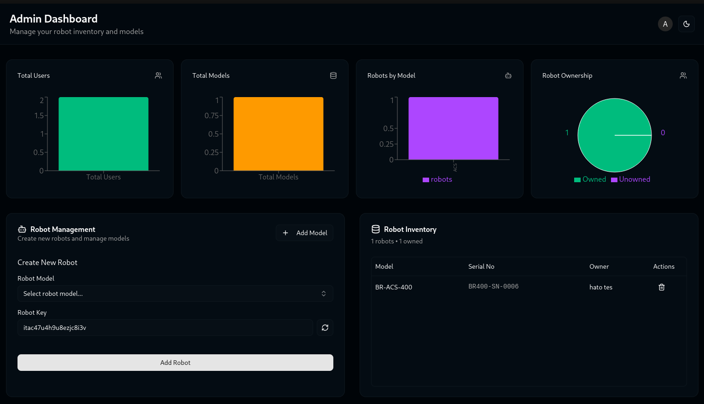

# Beam Robotics | Central Command Center 🚀

The **Beam Robotics Command Center** is the primary software backbone of the Beam Robotics ecosystem. It is a centralized, enterprise-grade management portal designed to handle secure authentication, cryptographic registration, and fleet-wide monitoring of all Beam Robotics hardware.

---

## 🌐 The Platform Vision
This Command Center acts as the "Brain in the Cloud." It is engineered for high scalability, allowing customers to unify a diverse array of purchased products—from **Autonomous Security Robots** to **Smart Access Control Units**—under a single, encrypted account using a "Product-as-a-Service" model.

### Strategic Infrastructure:
- **Unified Fleet Management:** A single pane of glass to monitor the health and status of every device in your organization.
- **Cryptographic Serial Binding:** Securely link physical hardware to digital accounts via unique, hardware keys.
- **Administrative Oversight:** A dedicated backend for managing the product lifecycle, generating security keys, and auditing global system performance.

---

## 📟 Core Functional Modules

### 1. Secure Auth Portal
The entry point for the Beam Robotics ecosystem. Built with security-first protocols (Better-Auth) to ensure that sensitive hardware telemetry and control links are accessible only to verified owners.


### 2. Main Dashboard (Beam Platform)
The central hub for the user experience. This provides a high-level summary of active products, recent system events, and navigation to specific hardware control modules.


### 3. Fleet Management
A specialized interface for handling hardware deployments. Users can view real-time status, registration details, and connectivity metrics for their entire registered fleet at a glance.


### 4. Admin Control Infrastructure
The master control panel for Beam Robotics operations. This module handles:
- **Serial Key Generation:** Managing the pool of cryptographic keys for hardware distribution.
- **Global Fleet Auditing:** Monitoring the deployment status and health of all units in the field.
- **Multi-Tenant Management:** Overseeing user permissions and enterprise-level access controls.


---

## 🛠 Technical Architecture

### The Stack
- **Frontend:** [Next.js 15](https://nextjs.org/) (App Router) with [Tailwind CSS](https://tailwindcss.com/) & [Shadcn UI](https://ui.shadcn.com/)
- **State & Data:** [Drizzle ORM](https://orm.drizzle.team/) with **PostgreSQL**
- **Authentication:** [Better Auth](https://better-auth.com/) (Secure multi-tenant sessions)
- **Real-Time Engine:** [Socket.io](https://socket.io/) (Bi-directional signaling and telemetry relay)

---

## 🏗 Repository Structure

```text
Beam-Command-Center/
├── src/
│   ├── app/dashboard/
│   │   ├── admin/      # Global hardware & key management
│   │   └── user/       # Personal fleet management & main dashboard
│   ├── components/     # UI Components (Fleet cards, Admin tables, Layouts)
│   └── lib/            # Auth & Drizzle database logic
├── express-server/     # Real-time signaling & telemetry relay
├── python-client/      # Edge bridge for hardware-to-cloud communication
├── drizzle/            # Schemas for Users, Products, and Serial Keys
└── public/             # Documentation assets and screenshots

```

---

## 🚀 Deployment

### 1. Configure Environment

Create a `.env.local` file in the root:

```env
DATABASE_URL=your_postgresql_url
BETTER_AUTH_SECRET=your_secret
NEXT_PUBLIC_APP_URL=http://localhost:3000

```

### 2. Run the Command Center

```bash
# Start the Dashboard
pnpm install && pnpm dev

# Start the Signaling Server
cd express-server && pnpm install && pnpm dev

```

---

## Future Roadmap

* **Enterprise Reporting:** Weekly automated summaries of hardware uptime and system utilization.
* **OTA Updates:** Remote firmware deployment pipeline for connected Beam Robotics hardware.
* **Autonomous Mission Planner:** Drawing waypoints on a map for the Security Robots via the Command Center interface.

---

## Contributor

**Hatim Ahmed Hassan** *Lead Architect & Founder, Beam Robotics*
